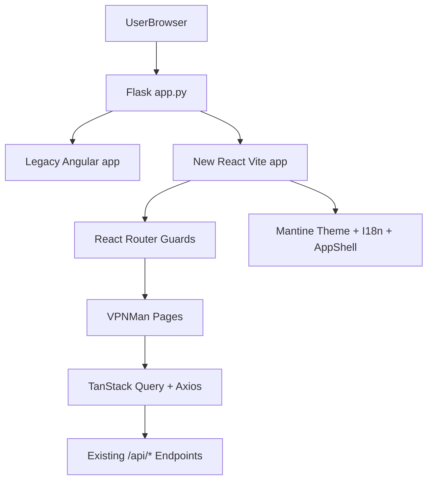

# VPNMan Frontend Redesign and Reimplementation Plan

## Goal and Constraints
- Deliver a **new side-by-side React frontend** in this repo (do not remove Angular yet).
- Achieve **full parity** with current Angular flows before cutover.
- Follow project frontend rules: React 19+, TypeScript 5+, Mantine 9+, Tabler 3+, zod 4+, Redux Toolkit 2+, TanStack Query 5+, axios 1.12+, Vite 7+, Vitest, ESLint.
- Reuse proven design/patterns from GRS frontend for:
  - AppShell layout: [`/home/kelvin/IdeaProjects/grs/frontend/src/layout/AppShellLayout.tsx`](/home/kelvin/IdeaProjects/grs/frontend/src/layout/AppShellLayout.tsx)
  - Theme/language switcher: [`/home/kelvin/IdeaProjects/grs/frontend/src/components/ThemeLocaleToolbar.tsx`](/home/kelvin/IdeaProjects/grs/frontend/src/components/ThemeLocaleToolbar.tsx)
  - i18n provider/hook/translations structure: [`/home/kelvin/IdeaProjects/grs/frontend/src/i18n/index.tsx`](/home/kelvin/IdeaProjects/grs/frontend/src/i18n/index.tsx), [`/home/kelvin/IdeaProjects/grs/frontend/src/hooks/useI18n.ts`](/home/kelvin/IdeaProjects/grs/frontend/src/hooks/useI18n.ts)
  - Auth gates and redirect behavior: [`/home/kelvin/IdeaProjects/grs/frontend/src/components/RequireAuth.tsx`](/home/kelvin/IdeaProjects/grs/frontend/src/components/RequireAuth.tsx), [`/home/kelvin/IdeaProjects/grs/frontend/src/components/RequireAdmin.tsx`](/home/kelvin/IdeaProjects/grs/frontend/src/components/RequireAdmin.tsx), [`/home/kelvin/IdeaProjects/grs/frontend/src/api/client.ts`](/home/kelvin/IdeaProjects/grs/frontend/src/api/client.ts)

## Current Scope to Rebuild (Angular parity)
- Public/app shell routes from [`/home/kelvin/IdeaProjects/vpnman/angular/src/app/app-routing.module.ts`](/home/kelvin/IdeaProjects/vpnman/angular/src/app/app-routing.module.ts):
  - `/` Home
  - `/client-setup`
  - `/my-client`
  - `/admin/status`, `/admin/log`, `/admin/config`, `/admin/clients`, `/admin/clients/:client_id`
  - `/forbidden`, `*` not found
- Core feature modules inferred from current components/services:
  - Account/auth + admin guard behavior: [`/home/kelvin/IdeaProjects/vpnman/angular/src/app/account.service.ts`](/home/kelvin/IdeaProjects/vpnman/angular/src/app/account.service.ts), [`/home/kelvin/IdeaProjects/vpnman/angular/src/app/admin.guard.ts`](/home/kelvin/IdeaProjects/vpnman/angular/src/app/admin.guard.ts)
  - API integration: [`/home/kelvin/IdeaProjects/vpnman/angular/src/app/admin.service.ts`](/home/kelvin/IdeaProjects/vpnman/angular/src/app/admin.service.ts), [`/home/kelvin/IdeaProjects/vpnman/angular/src/app/client.service.ts`](/home/kelvin/IdeaProjects/vpnman/angular/src/app/client.service.ts), [`/home/kelvin/IdeaProjects/vpnman/angular/src/app/status.service.ts`](/home/kelvin/IdeaProjects/vpnman/angular/src/app/status.service.ts)
  - Data models to convert to zod schemas: [`/home/kelvin/IdeaProjects/vpnman/angular/src/app/models.ts`](/home/kelvin/IdeaProjects/vpnman/angular/src/app/models.ts)

## Target Architecture (Side-by-side)

## Implementation Phases

### Phase 1: Bootstrap New React Frontend (side-by-side)
- Create a new `frontend/` app (Vite + React + TS) without touching Angular runtime behavior.
- Set up dependency stack aligned with the frontend rules and matching GRS patterns.
- Add baseline app scaffolding:
  - Providers (`MantineProvider`, `QueryClientProvider`, Redux `Provider`, i18n provider).
  - Shared axios client + interceptor that handles backend `redirect_url` login flow.
  - Error parsing via zod-based basic error schema.
- Wire temporary dev/proxy and static asset handling so React can call existing Flask `/api/*` endpoints.

### Phase 2: Reuse and Adapt Shared UX Infrastructure
- Port and adapt AppShell layout and toolbar patterns from GRS to VPNMan branding/navigation.
- Implement locale + color scheme persistence and language switching.
- Build route guards:
  - `RequireAuth`: loading state, OAuth redirect fallback, forbidden redirect.
  - `RequireAdmin`: admin group gate via current user groups.
- Add shared UI primitives:
  - `ErrorMessage`, query loading indicator, confirmation modal wrapper (for revoke/restart/delete actions).

### Phase 3: Domain Models and API Layer
- Define zod schemas + inferred TS types for VPNMan entities now in Angular models (`User`, `Client`, `ClientCredential`, `OpenVPNInfo`, `RouteRule`, etc.).
- Implement typed API functions mirroring existing backend endpoints from `app.py` and Angular services.
- Replace Angular imperative loading flags with React Query keys/mutations and targeted cache invalidation.
- Keep endpoint behavior identical (including admin actions and config export links).

### Phase 4: Feature Parity Pages
- Implement route tree equivalent to Angular routes using React Router nested layouts.
- Rebuild pages/components in parity order:
  1. Home + quick actions + server online status
  2. My Client + credential cards + export actions
  3. Client Setup guide (OS-tabbed setup content and download modal)
  4. Admin shell tabs
  5. Admin Status (management info, connected clients, kill action)
  6. Admin Log (log table + severity highlighting)
  7. Admin Config (route CRUD + restart/shutdown operations)
  8. Admin Clients list/import + Admin Client detail/generate credential/revoke flow
- Preserve all current safety confirmations for destructive operations.

### Phase 5: Verification and Rollout Readiness
- Add focused tests (Vitest) for:
  - zod model parsing
  - admin/auth guards
  - key data transforms (credential validity status, log severity, route form validation)
- Run lint/test/build for new frontend.
- Produce parity checklist against each current Angular page/action.
- Keep Angular untouched for fallback until you approve final cutover.

## Non-obvious Migration Notes
- Current Angular auth/admin redirect behavior relies on backend `redirect_url` on auth failures; React must preserve this exactly to avoid login regressions.
- Current credential validity logic uses certificate window checks (`validity_start`, `validity_end`); this needs explicit utility parity to avoid showing invalid credentials as downloadable.
- `client-setup` contains long instructional copy and OS-specific download affordances; migrate content first as structured data (per-OS sections) to keep future i18n manageable.

## Deliverables
- New `frontend/` React codebase with complete Angular feature parity.
- Shared architecture following GRS patterns for AppShell, auth, and i18n.
- Verified side-by-side operation with existing backend APIs and Angular app still available.
- Clear cutover checklist for replacing Angular as default in a later step.